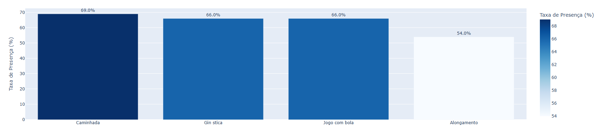
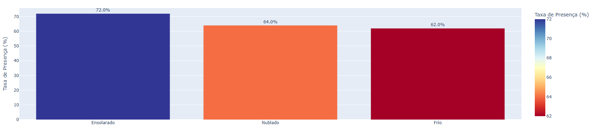

# Utilizando análise de dados no incentivo às práticas de atividades físicas por idosos

# 📈 Objetivos do Projeto

  Este trabalho teve como objetivos implementar um método de acompanhamento, registrando a evolução e identificando o que influencia na maior participação nas atividades pelos idosos, desenvolver um sistema de gamificação que gerasse maior engajamento das participantes e aumentassem a adesão nas atividades, auxiliar a professora no contato com as participantes afim de aumentar a presença nas aulas.

# 📊 Tecnologias Utilizadas

- **Linguagem**: Python
- **Bibliotecas**: Pandas, Numpy, sklearn
- **Ferramentas de Visualização**: plotly
- **Ambiente de Desenvolvimento**: Jupyter Notebook

- ## 🔍 Principais Insights

- **Taxa de Presença por Tipo de Exercicío**
 

Existe uma variação na presença das alunas conforme a escolha da atividade, vale entender se não é possível alterar as atividades de menor engajamento.

- **Taxa de Presença por Condição Climática**
 

Como de se esperar, em dias mais frios a taxa de presença é menor do que em dias ensolarados ou nublados.

