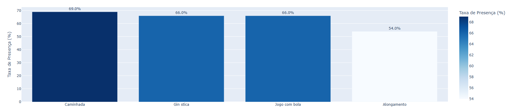
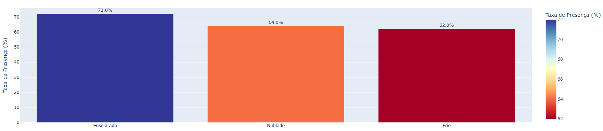
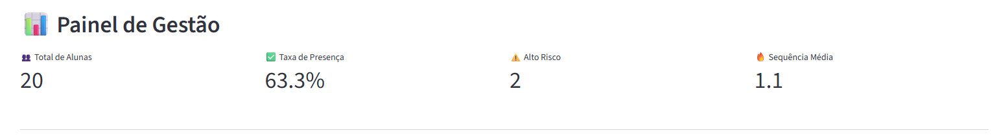
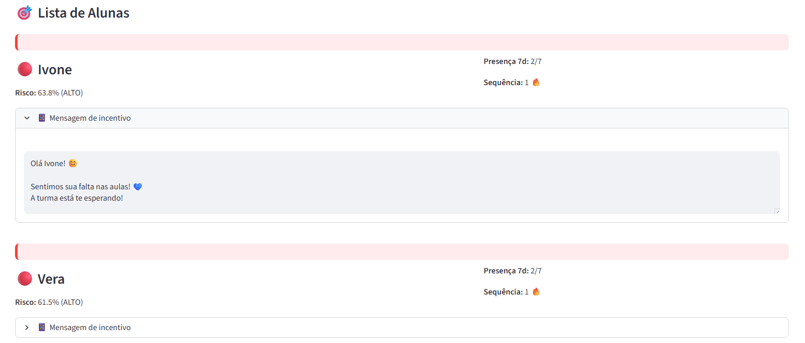
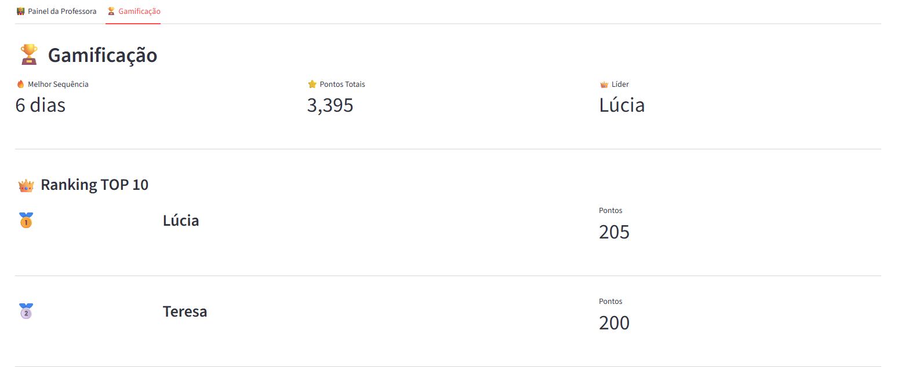

# Utilizando análise de dados no incentivo às práticas de atividades físicas por idosos

# 📈 Objetivos do Projeto

  Este trabalho teve como objetivos implementar um método de acompanhamento, registrando a evolução e identificando o que influencia na maior participação nas atividades pelos idosos, desenvolver um sistema de gamificação que gerasse maior engajamento das participantes e aumentassem a adesão nas atividades, auxiliar a professora no contato com as participantes afim de aumentar a presença nas aulas.

# 📊 Tecnologias Utilizadas

- **Linguagem**: Python
- **Bibliotecas**: Pandas, Numpy, sklearn
- **Ferramentas de Visualização**: plotly
- **Ambiente de Desenvolvimento**: Jupyter Notebook

- ## 🔍 Principais Insights

- **Taxa de Presença por Tipo de Exercicío**
 

Existe uma variação na presença das alunas conforme a escolha da atividade, vale entender se não é possível alterar as atividades de menor engajamento.

- **Taxa de Presença por Condição Climática**
 

Como de se esperar, em dias mais frios a taxa de presença é menor do que em dias ensolarados ou nublados.

- ## 🔍 Dashboard

- O Dashboard demonstra para a professora um painel com a taxa de presença média, e as alunas que estão em risco de não comparecerem às aulas, dando também uma sugestão de mensagem de incentivo:

- 

- 

- No Painel da Gamificação, é possível ver um ranking com as alunas mais presentes:

- 

# 📋 Modelo Preditivo

**Resumo dos resultados**:

- Acurácia: 61.54% (representa a proporção de todas as previsões corretas).

# 📋 Apresentação e Participação junto às alunas e professora

# 📋 Considerações Finais

  O Projeto teve como objetivo desmonstrar a aplicação de recursos de ciencia de dados no incentivo e principalmente melhora a adesão de idosos a atividades fisicas.
  A partir das análises exploratórias dos dados, foi possível entender o comportamento das participantes e o que leva à presença no dia a dia, sua satisfação e engajamento com as aulas e atividades propostas. Os gráficos desenvolvidos demonstram padrões de frequencia e de preferencia por determinadas atividades, permitindo identificar quais atividades tem maior participação.
  A gamificação propos para o projeto uma forma lúdica e motivadora de aumentas o engajamento, e fomentando uma competição saudável entre as alunas.
  Além disso, a implementação do modelo preditivo possibilitou estimar quando as alunas poderiam faltar, permitindo que a professora entrasse em contato, agindo antecipadamente, além de gerar um senso de pertencimento a comunidade, o que reduz as chances de ausencias.
  O dashboard foi a integração de todos esses elementos, uma ferramenta simples que possibilitou que as alunas usufruissem de algo tecnologico e que a professora pudesse dirigir as aulas com maiores clareza do que agrada ou não a comunidade.
  O trabalho demonstra o potencial das ferramentas de analise de dados no contexto social e comunitário, demonstrando como essas ferramentas podem contribuir para promoçaõ de saúde, qualidade de vida e bem-estar.
  Em resumo, o projeto cumpriu seus objetivos propostos, colocando a ciencia de dados e suas ferramentas em prol da comunidade.

